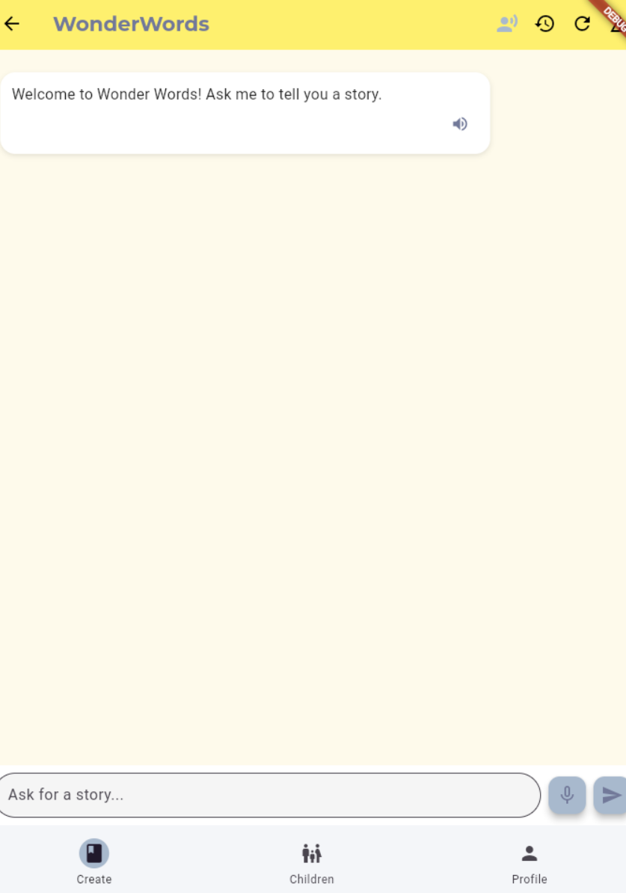

# WonderWords

**WonderWords** is an AI-powered storytelling app designed to help children create and read personalized stories. Using large language models (LLMs) like GPT-4o and LLaMA, WonderWords enables both parents and children to explore creativity, build literacy, and develop emotional expression through interactive storytelling.


## ✨ Features

- 📖 AI-generated personalized stories based on prompts and themes
- 👨‍👩‍👧 Parent and child login support with separate user flows
- 🧠 Age-adjusted reading level with parental oversight
- 🎤 Speech-to-text and text-to-speech support
- 📚 Shareable and assignable story collections
- 🔒 Firebase Authentication for secure access



## 📱 Application Structure

The app follows a **3-tier architecture**:
- **Frontend**: Flutter & Dart, built for mobile/tablet
- **Backend**: Flask (Python), deployed via SJSU HPC
- **Database**: Firebase (auth), AWS RDS (messages), GlueDB (model training)

## 🧱 Running the App

**Backend**
```bash
cd backend
python app.py
```

**Frontend**
```bash
cd wonder_words_flutter_application
flutter run -d <device>
```

## 👨‍👩‍👧‍👦 User Types

- **Parents** can:
  - Create and manage child accounts
  - Start or continue stories
  - Assign stories to children
- **Children** can:
  - Log in using name and secret pin
  - Pick story themes and ask follow-up questions
  - Access stories assigned to them


## 📂 Story Themes

Children can choose from preset themes:
- Dragons 🐉
- Space 🚀
- Animals 🐾
- Magic ✨
- Pirates 🏴‍☠️
- Dinosaurs 🦕
- Fairy Tales 🏰
- Adventure 🧭


They can also select how the story evolves using follow-up prompts like:
- "What happens next?"
- "Make it funny!"
- "Add a twist!"


## 🧒 Child Experience

- Simple and colorful UI
- Safe prompts and moderated responses
- Personalized story library
- Text-to-speech narration for accessibility


## 🛠️ Technologies Used

### Frontend
- Flutter (Dart)
- firebase_core, firebase_auth
- flutter_tts, provider, google_fonts, http

### Backend
- Flask (Python)
- SQLAlchemy (AWS RDS)
- OpenAI API (GPT-4o)
- HuggingFace (LLaMA)
- Google Cloud TTS

### Model & Data
- TinyStories dataset (via Kaggle)
- GlueDB for fine-tuning evaluation prompts

## 👩‍💻 Contributors

- Alexis Bryan Ambriz  
- Kelly Nguyen  
- Nick Kornienko  
- Joash Muganda  

## 📘 Academic Acknowledgment

This project was developed as part of the Master of Science in Software Engineering at **San Jose State University**, Spring 2025.

## 🔐 Version

`v1.0.0`
